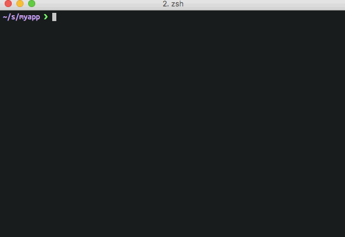
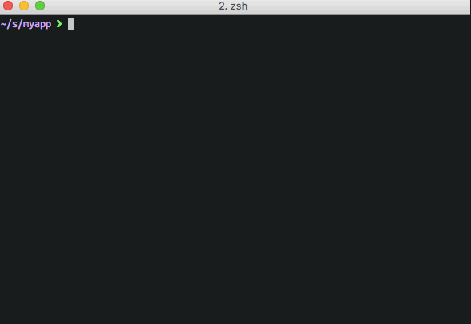
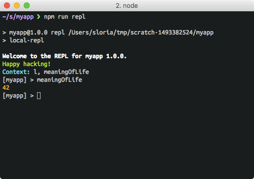

# local-repl


[](https://www.npmjs.org/package/local-repl)
[](https://travis-ci.org/sloria/local-repl)

Project-specific REPLs for Node.js. `local-repl` allows you to automatically import modules and values into your REPL sessions with simple configuration in your project's `package.json` and/or `.replrc.js`.


## Add local-repl to your project

```
$ npm install local-repl --save-dev
# OR
$ yarn add local-repl --dev
```

Add the following to `package.json`.

```json
{
  "scripts": {
    "repl": "local-repl"
  },
  "devDependencies": {
    "local-repl": "^1.0.0"
  },
  "dependencies": {
    "lodash": "^4.17.4",
  },
  "repl": [
    "lodash",
  ]
}
```

## Run it

```
$ npm run repl 
```

This will start a REPL session with `lodash` already imported.



## Specifying aliases

You can pass an array of objects containing the keys `"name"` (required), `"module"` (for imports), or `"value"` (for values).

```json
{
  "repl": [
    {"name": "l", "module": "lodash"},
    {"name": "meaningOfLife", "value": 42}
  ]
}
```



## Importing local modules

Local modules can be imported, too.

```json
{
  "repl": [
    {"name": "project", "module": "./"},
    {"name": "utils", "module": "./lib/utils"}
  ]
}
```

## Using `.replrc.js`

In addition to configuration in "package.json", you may optionally define your configuration in a `.replrc.js` file. This is useful if you want to dynamically compute modules and values for your REPLs..

```js
// .replrc.js
const User = require('./myapp/models/User');

const me = User.getByEmail.sync('sloria');

module.exports = {
  'context': [
    'lodash',
    'myapp/utils',
    {name: 'me', value: me},
  ]
}
```

**Note**: Configuration defined in `.replrc.js` takes precedence over configuration defined in `package.json`.

## More configuration

### Configuring the prompt

In package.json:

```json
{
  "repl": {
    "prompt": "myproject $"
  }
}
```

In `.replrc.js`:

```javascript
// .replrc.js

module.exports = {
  prompt: 'myproject $'
}
```

You can also define `prompt` as a function in `.replrc.js`:

```javascript
// .replrc.js

module.exports = {
  prompt: (context, pkg) => {
    return `${pkg.name} ${pkg.version} $`
  }
}
```

### Configuring the banner

In package.json:

```json
{
  "repl": {
    "banner": "Welcome to the myapp REPL. Happy hacking!"
  }
}
```

You can also define `banner` as a fuction in `.replrc.js`. The function will receive the REPL context and the parsed `package.json` object.

```javascript
// .replrc.js
const _ = require('lodash');
const chalk = require('chalk');

module.exports = {
  context: [
    {name: 'l', value: _},
    {name: 'meaningOfLife', value: 42},
  ],
  banner: (context, pkg) => {
    console.log(chalk.bold(`Welcome to the REPL for myapp ${pkg.version}.`));
    console.log(chalk.green('Happy hacking!'));
    console.log(chalk.cyan('Context:'), _.keys(context).sort().join(', '));
  }
}
```



## Inspiration

`local-repl` is inspired a number of other great projects:

- [konch](https://github.com/sloria/konch) - REPL configuration for Python
- [n_](https://github.com/borisdiakur/n_) - Node.js REPL with lodash

## License

MIT licenses. See [LICENSE](https://github.com/sloria/local-repl/blob/master/LICENSE) for more details.
